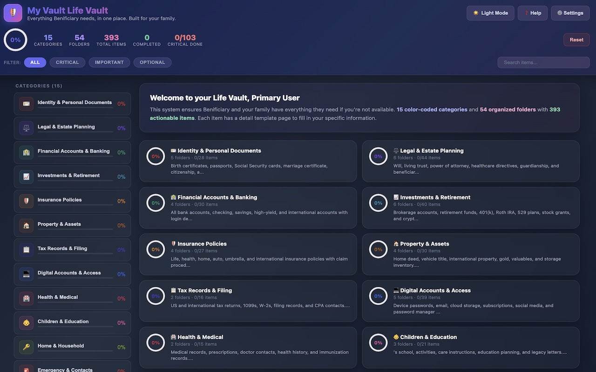
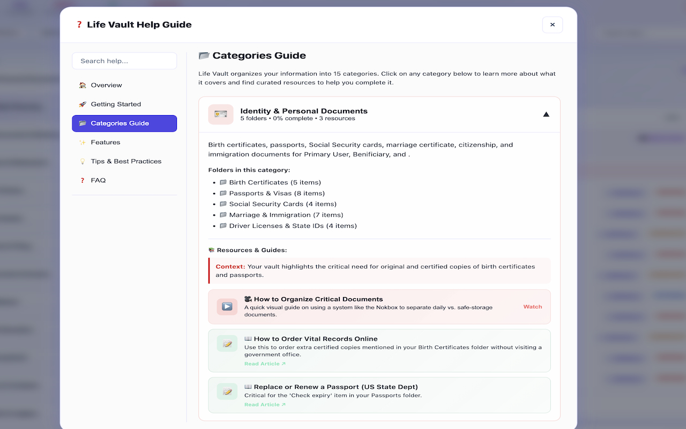
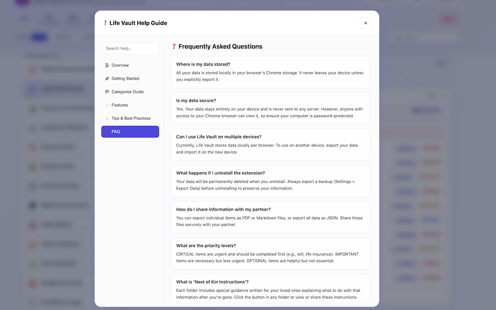
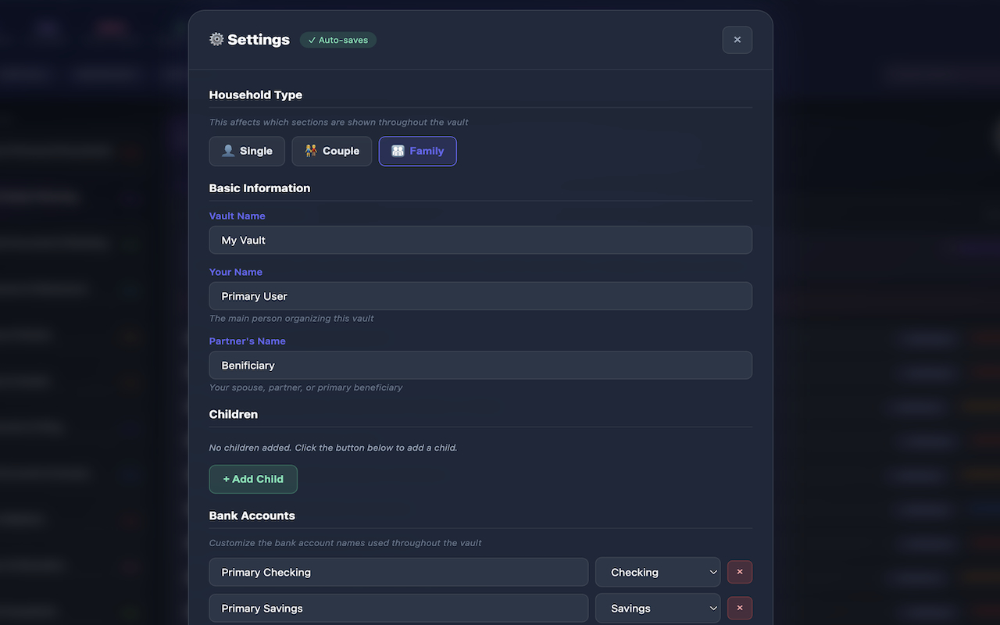
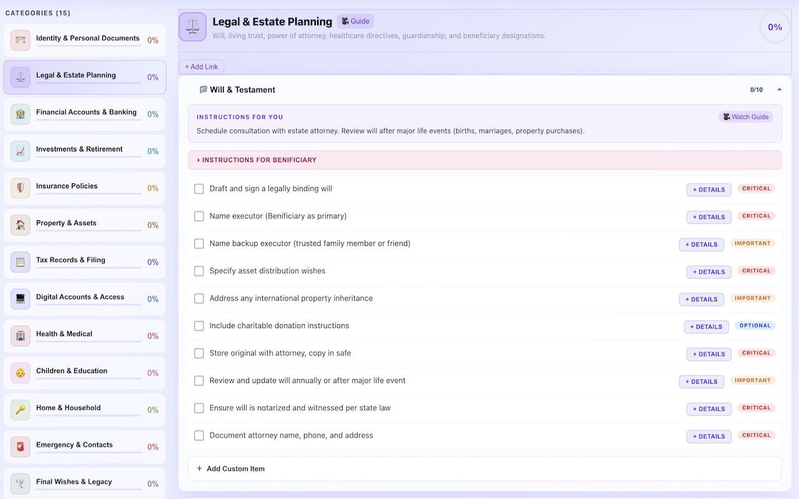

# Family Life Vault

A comprehensive Chrome extension for organizing digital legacy, estate planning, and important family documents. Built to ensure your family has everything they need in one place.

## Chrome Extension
[Chrome Web Store Install[(https://tinyurl.com/life-vault)

## Quick Start

1. Download or clone this repository
2. Open Chrome → `chrome://extensions/`
3. Enable **Developer mode** (top-right toggle)
4. Click **Load unpacked** → Select the `life-vault` folder
5. Click the extension icon to open the vault
6. Complete the **5-step setup wizard** with your family information

---

## Features


### Glassmorphism UI Design

The app features a modern **Glassmorphism** design language with:

- **Frosted glass effects** - Semi-transparent panels with backdrop blur
- **Subtle gradients** - Indigo to purple to pink color scheme
- **Smooth animations** - All interactions include fluid 0.3s transitions
- **Depth & shadows** - Layered UI with glass-like shadows and glows
- **Premium aesthetics** - Clean, modern look that's easy on the eyes

### Light & Dark Theme

Switch between themes anytime:

| Theme | Description |
|-------|-------------|
| **Dark Mode** (default) | Deep slate backgrounds with frosted glass panels, optimized for low-light environments |
| **Light Mode** | Soft lavender/white backgrounds with subtle glass effects, great for bright environments |

**How to switch:**
- Click the **sun/moon toggle button** in the header for quick switching
- Or go to **Settings > Appearance** to select your preferred theme
- Your preference is automatically saved and persists across sessions

### Personalized Setup Wizard

When you first install the extension, a guided setup wizard helps you personalize your vault:

| Step | What You'll Configure |
|------|----------------------|
| 1. Welcome | Introduction to the vault |
| 2. Household Type | Choose Single, Couple, or Family |
| 3. Basic Info | Your vault name and your name |
| 4. Partner/Beneficiary | Your partner (couple/family) or primary beneficiary (single) |
| 5. Children | Add children's names (family only) |
| 6. Complete | Review your settings and start using the vault |

The wizard adapts based on your household type - single users skip the children step, while couples and families see relevant fields for their situation.

### Household Types

Life Vault supports three household configurations:

| Type | Description | What's Included |
|------|-------------|-----------------|
| **👤 Single** | Just you managing your documents | Primary beneficiary field, no children section |
| **👫 Couple** | You and your partner | Partner name, no children section |
| **👨‍👩‍👧‍👦 Family** | Partner and children | Partner name + children list |

**How household type affects the vault:**
- **Single users**: Child-related checklist items are automatically hidden (no birth certificates for children, etc.)
- **Couples**: Child items are hidden, partner name is used throughout
- **Families**: All sections are shown, child items expand dynamically for each child added

You can change your household type anytime in Settings - the vault will automatically adjust which items are displayed.

### Help Guide

Access the built-in Help Guide via the **❓ Help** button to:

- **Overview** - Get started with step-by-step instructions
- **Categories Guide** - Browse all 15 categories and 54 folders with descriptions, plus embedded video guides and articles for each category
- **Features** - Learn about all the features available in Life Vault
- **Tips & Best Practices** - Best practices for organizing your digital legacy
- **FAQ** - Comprehensive answers to common questions

The Help Guide includes searchable content, expandable category details with integrated educational resources (videos and articles), and a thorough FAQ section to help you understand what information to gather for each section.





### Settings Panel

Access settings anytime via the **gear icon** to:

- **Household Type** - Switch between Single, Couple, or Family modes
- **Appearance** - Switch between light and dark themes
- Update family member names (your name, partner/beneficiary)
- Add or remove children dynamically (Family mode only)
- Customize bank account names and types (Checking, Savings, High-Yield, Foreign, Credit Card, Investment)
- Add quick links to important documents (Notion, Google Drive, etc.)
- Export or import your data



### Dynamic Checklist Items

The app automatically generates checklist items based on your settings:

**Dynamic Children Items:**
- If you have multiple children (e.g., "Alice" and "Bob"), items like "{firstChild} birth certificate" automatically expand to:
  - "Alice birth certificate"
  - "Bob birth certificate"
- Works across all categories: birth certificates, passports, SSN cards, medical records, 529 plans, etc.

**Dynamic Bank Account Items:**
- Bank accounts you add in settings automatically appear in the appropriate checklist folders:
  - Checking accounts → "Checking Accounts" folder
  - Savings/HYS accounts → "Savings Accounts" folder
  - Foreign accounts → "International Bank Accounts" folder
  - Investment accounts → "Brokerage & Investment Accounts" folder
  - Credit cards → "Credit Cards" folder



### Custom Checklist Items

Add your own custom items to any folder:

**How to add custom items:**
1. Open any folder by clicking on it
2. Scroll to the bottom and click **"+ Add Custom Item"**
3. Enter your item description
4. Select a priority level (Critical, Important, or Optional)
5. Click **"Add Item"**

**Custom item features:**
- **Priority tagging** - Tag each item as Critical (red), Important (yellow), or Optional (blue)
- **Details template** - Click "+ Details" to add detailed information including:
  - Detailed description
  - Location / where to find
  - Account/reference numbers
  - Contact information
  - Instructions for your next of kin
  - Deadlines and timelines
  - Additional notes and links
- **Visual distinction** - Custom items display with a colored left border
- **Delete option** - Remove custom items anytime with the × button
- **Progress tracking** - Custom items are included in all progress calculations
- **Export/Import** - Custom items are saved in backups and can be restored

### Category Quick Links

Add quick links directly to any category header for fast access to relevant resources:

**How to add category quick links:**
1. Select a category from the sidebar
2. In the category header, click **"+ Add Link"**
3. Enter a label (e.g., "SSA Portal", "DMV Website")
4. Enter the URL (https:// is auto-added if missing)
5. Click **"Add Link"**

**Category quick link features:**
- **Displayed in category header** - Quick access without scrolling
- **One-click removal** - Click the × button to delete any link
- **Auto URL formatting** - Automatically adds https:// if you forget
- **Per-category organization** - Each category has its own set of links
- **Export/Import** - Category links are included in backups

This is different from the global Quick Links in Settings — category quick links are specific to each category and appear right in the category header for contextual access.

### 15 Color-Coded Categories

| Category | Description |
|----------|-------------|
| Identity & Personal Documents | Birth certificates, passports, SSN cards, immigration docs |
| Legal & Estate Planning | Wills, trusts, power of attorney, healthcare directives |
| Financial Accounts | Bank accounts (domestic & international), credit cards, investment accounts |
| Insurance | Life, health, property, and disability insurance |
| Property & Assets | Real estate (domestic & foreign), vehicles, valuables, gold/jewelry |
| Taxes | US and international tax records and professionals |
| Digital Life | Password managers, email, subscriptions, social media |
| Medical & Health | Providers, history, prescriptions, records |
| Family & Childcare | School info, childcare, education plans |
| Employment & Income | Employer details, benefits, side projects |
| Debts & Obligations | Mortgages, loans, recurring payments |
| Home & Utilities | Utility accounts, home maintenance, service providers |
| Emergency Contacts | Key people, attorneys, financial advisors |
| After Death Playbook | First 48 hours, first 30 days action items |
| Legacy & Memories | Funeral wishes, letters, family history |

### Progress Tracking

- **Overall progress ring** showing completion percentage
- **Per-category progress bars** in the sidebar
- **Per-folder progress** showing items completed
- **Visual indicators** (green dots) for fully completed sections

### Priority-Based Filtering

Items are tagged by priority:

- **CRITICAL** (Red) - Must be done immediately
- **IMPORTANT** (Yellow) - Should be done soon
- **OPTIONAL** (Blue) - Nice to have

### 50+ Detailed Templates

Each checklist item can have a detailed form with:

- Document details (numbers, dates, locations)
- Storage information
- **Digital scan URL** - Link to cloud storage (Google Drive, Dropbox, etc.)
- After-death instructions for your family
- Contact information and processes

Templates include: birth certificates, passports, foreign travel documents, bank accounts (domestic & foreign), credit cards, investment accounts, retirement accounts, crypto wallets, insurance policies, real property (domestic & foreign), vehicles, valuables, wills, trusts, power of attorney, medical providers, prescriptions, and many more.

### Digital Document Storage Links

Every template includes a **"Where is the digital scan stored?"** field:

- **Enter a URL** to your cloud-stored document (Google Drive, Dropbox, OneDrive, etc.)
- **Clickable link** - After saving, the URL displays as a clickable link
- **Open in new tab** - Click the green "open" button to view your document
- **Easy editing** - Click the pencil icon to modify the URL
- **PDF export** - URLs appear as clickable links in exported PDFs

### Autosave Details

All template details are **automatically saved** as you type - no save button needed:

- **Visual feedback** - "Saving..." indicator appears while typing, "Autosaved" confirmation when complete
- **Debounced saves** - Data saves 500ms after you stop typing (prevents excessive saves)
- **URL field transition** - URL fields automatically switch to clickable link display when you finish editing
- **Preserved cursor** - Your typing position is maintained during autosave (no disruptive re-renders)
- **Header indicator** - Autosave status shown in modal header next to the close button

### International/Foreign Support

The app includes templates for international assets:

- **Foreign Bank Accounts** - With fields for country, currency, SWIFT/routing codes, repatriation instructions
- **Foreign Property** - With succession process, local contacts, tax implications
- **Foreign Tax Records** - With tax IDs, national IDs, tax treaty information
- **Foreign Travel Documents** - Secondary passports, travel documents

### Instructions for Next of Kin

Each folder includes:
- **Instructions for You** - What you need to do to organize
- **Instructions for [Partner Name] (NOK)** - Expandable section with specific guidance for your next of kin

### Export Options

**Individual Items:**
- Export as Markdown (`.md` file)
- Export as PDF (print-friendly page with Print/Save button)

**Full Backup:**
- JSON export with all checklist states, template data, and settings
- Import function to restore from backup

---

## How to Use

### Working Through Items

1. **Select a category** from the sidebar or dashboard
2. **Expand a folder** by clicking on it
3. **Check off items** as you complete them
4. **Click "+ Details"** to fill in the detailed template
5. **Your details autosave** - watch for the "Autosaved" indicator in the header

### Filtering & Searching

- Use **filter buttons** (All, Critical, Important, Optional) to focus
- Use the **search box** to find specific items across all categories

### Viewing NOK Instructions

1. Expand any folder
2. Click **"▸ Instructions for [Partner Name] (Next of Kin)"**
3. Read the specific guidance written for your family member

### Managing Settings

1. Click the **⚙ Settings** button in the header
2. Update family names, add/remove children
3. Customize bank accounts with names and types:
   - **Checking** - Regular checking accounts
   - **Savings** - Standard savings accounts
   - **High-Yield Savings** - Online high-yield savings
   - **Foreign Account** - International/overseas bank accounts
   - **Credit Card** - Credit card accounts
   - **Investment** - Brokerage and investment accounts
4. Add quick links to your important documents
5. Click **Save Settings** to apply changes

---

## File Structure

```
life-vault/
├── manifest.json      # Chrome extension configuration (v1.9.1)
├── app.html           # Main application HTML with Glassmorphism CSS
├── app.js             # Core application logic (~2500 lines)
├── data.js            # Categories, folders, and checklist items
├── templates.js       # 50+ detailed template definitions (including custom_item)
├── background.js      # Extension background service worker
├── icons/             # Extension icons with "Life Vault" branding
│   ├── icon16.svg     # 16px icon (LV initials)
│   ├── icon48.svg     # 48px icon (LV initials)
│   └── icon128.svg    # 128px icon (LIFE VAULT text)
├── CLAUDE.md          # LLM context file for AI assistants
└── README.md          # This file
```

---

## Data Storage

All data is stored locally using Chrome's `chrome.storage.local` API with **unlimited storage** enabled:

| Key | Purpose |
|-----|---------|
| `lifeorg-checked` | Checklist states (regular and custom items) |
| `lifeorg-templates` | Template form data (regular and custom items) |
| `lifeorg-settings` | User settings (names, bank accounts, links) |
| `lifeorg-setup-complete` | Setup wizard completion flag |
| `lifeorg-theme` | Theme preference (light/dark) |
| `lifeorg-custom-items` | User-created custom checklist items |
| `lifeorg-category-quick-links` | Per-category quick links |

**Data never leaves your device unless you export it.**

---

## Customization

### Placeholder System

The app uses these placeholders that get replaced with your settings:

| Placeholder | Replaced With |
|-------------|---------------|
| `{primaryUser}` | Your name |
| `{partner}` | Your partner's name |
| `{firstChild}` | Your first child's name (or each child when expanded) |
| `{children}` | All children's names (comma-separated) |
| `{familyName}` | Your family name |

### Dynamic Item Expansion

Items containing `{firstChild}` are automatically expanded to create one item per child when you have multiple children configured in settings. This happens automatically - no code changes needed.

### Adding New Items

Edit `data.js` to add new items to any folder:

```javascript
{ text: "Your new item description", priority: "critical" }
```

### Adding New Templates

Edit `templates.js` to create new template types with custom fields.

### Adding New Categories

Add a new category object to the `CATEGORIES` array in `data.js`.

---

## Tips for Success

1. **Start with Critical items** - Use the Critical filter to focus on essentials first
2. **Fill templates as you go** - Don't just check boxes; fill in the details
3. **Export regularly** - Create JSON backups monthly
4. **Share with your NOK** - Walk through the vault with your family member
5. **Review annually** - Update expired documents, changed accounts, etc.
6. **Add Quick Links** - Link to your existing Notion pages or Google Drive folders
7. **Configure bank accounts** - Add all your accounts in settings for dynamic checklist items

---

## Privacy & Security

- All data stored locally on your device
- No external servers or cloud sync
- No analytics or tracking
- Export files should be stored securely
- Consider encrypting exported backups

---

## Troubleshooting

| Issue | Solution |
|-------|----------|
| Data not saving | Check storage permissions; reload extension from `chrome://extensions/` |
| Export not working | Allow pop-ups for the extension; check download permissions |
| Extension not loading | Ensure all files are present; check console (`F12`) for JavaScript errors |
| Want to reset | Remove extension from `chrome://extensions/`, clear site data, reload |
| Children items not expanding | Ensure you have multiple children added in Settings |
| Bank accounts not appearing | Check that bank account types match the folder (checking/savings/foreign/investment/credit) |

---

## Version History

| Version | Changes |
|---------|---------|
| **v1.9.1** | **Unlimited Storage** - Added `unlimitedStorage` permission to remove the 5MB quota limit on local storage, allowing the vault to store extensive document details and templates without space constraints |
| **v1.9.0** | **Template Autosave** - All template details now automatically save as you type, eliminating the need for a manual "Save Details" button. Features a visual autosave indicator ("Saving..." / "Autosaved") in the modal header, debounced saves (500ms) to prevent excessive storage writes, and automatic URL field transition to link display when you finish editing. Preserves cursor position during saves for uninterrupted typing |
| **v1.8.0** | **Household Type Support** - Choose between Single, Couple, or Family modes in the setup wizard and settings. Single users see a streamlined vault without child-related items. Couples get partner fields without children sections. Families get full access to all features. Child-related checklist items are automatically hidden for single users and couples. Setup wizard adapts dynamically based on your household selection. Existing users are automatically migrated based on their current settings. Empty placeholder fields (partner, children) are handled gracefully |
| **v1.7.0** | **Category Quick Links** - Add quick links directly to any category header for fast access to relevant resources (SSA Portal, DMV, etc.). Links display in the category header with one-click removal. Auto-adds https:// if missing. Included in export/import. Different from global settings quick links — these are per-category for contextual access |
| **v1.6.1** | **Improved Help Guide** - Integrated educational resources (videos & articles) directly into each category in the Categories Guide for contextual learning. Expanded FAQ with 15+ questions covering security, usage tips, and best practices. Improved scroll position preservation in help modal |
| **v1.6.0** | **Digital Scan URL Fields** - Added "Where is the digital scan stored?" URL field to all templates. URLs display as clickable links after saving, with "Open" button to view document in new tab and "Edit" button to modify. URLs are clickable in PDF exports. CSP-compliant implementation |
| **v1.5.0** | **Custom Checklist Items & Extended Dynamic Items** - Users can now add their own custom items to any folder with priority tagging (Critical/Important/Optional) and a dedicated details template. Custom items are visually distinguished, can be deleted, and are included in progress tracking and export/import. Added dynamic checklist items for investment accounts and credit cards - accounts added in settings now automatically appear in "Brokerage & Investment Accounts" and "Credit Cards" folders. Improved light mode styling for PDF export button |
| **v1.4.0** | **Glassmorphism UI redesign** with frosted glass effects, light/dark theme toggle, updated "Life Vault" branding on icons, CSS variables for theming, smooth transitions, and persistent theme preference |
| **v1.3.0** | Built-in Help Guide with overview, all categories browser, curated video guides, tips section, and searchable content |
| **v1.2.0** | Dynamic children items (auto-expand for multiple children), dynamic bank account items, foreign/international templates (bank, property, tax), foreign travel document support |
| **v1.1.0** | Generic release with setup wizard, settings panel, placeholder system, multiple children support, configurable bank accounts, quick links |
| **v1.0.0** | Initial release with 15 categories, 50+ templates, and full export functionality |

---

## Running the Test Suite

The `tests/` directory contains a full test suite covering all core functionality. No installation or build step is required.

### Option 1: Headless (Node.js) — recommended

```bash
node tests/run-tests-headless.js
```

Runs all 160 tests in Node.js with colored terminal output. Returns exit code `0` on success and `1` if any tests fail (CI-friendly).

**Requirement:** Node.js 14+

### Option 2: Browser (visual UI)

```bash
# macOS
open tests/test-runner.html

# Linux
xdg-open tests/test-runner.html

# Or use the helper script (auto-detects OS)
./tests/run-tests.sh
```

Opens a visual test runner in your default browser showing collapsible pass/fail results per suite. Also open the browser console (F12) for detailed output.

### What's covered

160 tests across 52 suites, including:

- Theme switching (dark ↔ light) and persistence
- Dynamic item expansion for multiple children
- Dynamic bank account items (investment, credit card, checking, savings, foreign)
- Custom item creation, deletion, and data cleanup
- Custom items in progress calculations and export/import
- JSON export/import roundtrip and merge with defaults
- Template data saves for regular and custom items
- Template autosave behavior (multiple saves, URL fields, field preservation)
- Priority filter and search functionality
- Progress calculations (overall, per-category, per-filter)
- Data structure integrity (CATEGORIES, TEMPLATES, PRIORITY_COLORS)
- Helper function correctness (key generators, escAttr, placeholders)
- XSS prevention via escAttr
- Storage key uniqueness and completeness
- Category processing cache invalidation
- Help modal open/close, section navigation, category expansion, and search
- Category quick links add/delete, URL auto-formatting, persistence, and export/import
- Household type (single/couple/family) settings, dynamic behavior, and placeholder handling

See `tests/TESTING.md` for full documentation on the test architecture and how to add new tests.

---

## Credits

Inspired by [Nokbox](https://nokbox.com/) and comprehensive estate planning best practices.

---

*"Everything your family needs, in one place."*
